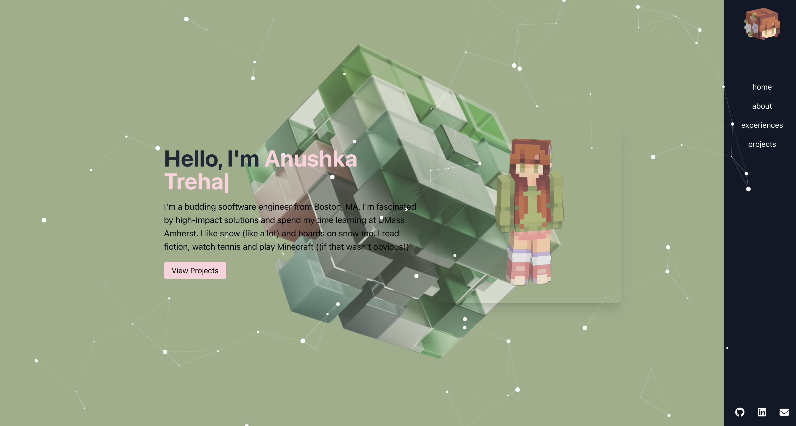

here's my personal protfolio! 

# 🌐 Anushka Trehan's Portfolio

Welcome to my personal portfolio website! This project showcases my skills, experiences, and projects in a clean and interactive format. Built with React and styled using Tailwind CSS, the portfolio is designed to be visually appealing, accessible, and responsive on all devices.

## 🎨 Live Demo




---

## 🚀 Technologies Used

- **React** - A JavaScript library for building user interfaces.
- **Tailwind CSS** - A utility-first CSS framework for custom, responsive designs.
- **Font Awesome** - For scalable icons in the navbar and footer.
- **react-typed** - For creating the animated typing effect in the hero section.
- **particles.js** - Used to add an interactive particles effect in the background.
- **React Router** - For navigating between sections.
- **Intersection Observer API** - For triggering animations as sections appear on scroll.

---

## 📂 Project Structure

This project was bootstrapped with [Create React App](https://github.com/facebook/create-react-app), which provides the foundational setup for a React application, including pre-configured Webpack and Babel. The file structure follows the standard format:


---

## 🖥️ Getting Started

To run this project locally, follow these steps:

### Prerequisites

- Node.js and npm installed on your machine.

### Installation

1. **Clone the repository**:
   ```bash
   git clone https://github.com/your-username/portfolio.git
   cd portfolio
